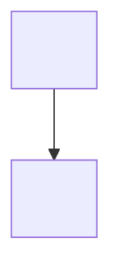

# README template

The skeleton below is the house format. Copy it, then replace every `<SLOT>` with a fact you read in the
target repository and **delete every section, row and bullet you have no evidence for**.

**A `<SLOT>` left in the output is a bug.** So is a section kept as a stub. The template is deliberately
over-complete: most projects will delete a third of it.

Guidance lines are marked `>>` — they are notes to you, never copied into the README.

---

```markdown
# <Product name> — <Component: Backend | Frontend | BFF | Mobile app | CLI | SDK | Service>

<BADGE WALL — see badges.md; 12–16 static badges, one per line, no blank lines between them>

>> Lead, 2–4 lines: what this system IS, and the transition it represents if it is a migration,
>> rebuild or greenfield replacement. Never "this repository contains".
<Lead paragraph.>

>> Second lead, 1–3 lines: what it SERVES — the concrete domains, surfaces or consumers, named.
<What it serves.>

---

## Table of contents

>> One entry per `##` heading below, in order, after deletions. GitHub anchor slugs: lowercase,
>> spaces → hyphens, punctuation dropped, `&` collapses to nothing (so "A & B" → "#a--b").
- [<Section>](#<anchor>)

---

## Tech stack

| Concern | Choice | Notes |
| :--- | :--- | :--- |
| Runtime | **<Runtime> <exact version>**, pinned in `<manifest>` | |
| Language | **<Language> <version>** | |
| Framework | **<Framework> <version>** | |
| Database | **<Engine> <version>** | <who else shares the instance> |
| Data access | **<ORM> <version>** + `<driver package>` | <ownership caveat> |
| Migrations | **<Tool> <version>** | Versioned scripts in [`<dir>/`](<dir>/) |
| Jobs | **<Scheduler> <version>** | <what was migrated into it> |
| Validation | **<Library> <version>** | <where it runs> |
| API docs | **<Tool> <version>** | <what feeds it> |
| Auth | **<Mechanism>**, <session shape> | <key-material note> |
| Local orchestration | **<Tool>** | <what it gives you> |
| Tests | **<Framework>**, **<Assertions>**, **<Mocks>** | <count, only if counted> |
| Code quality | **<Hook runner>**, `<config files>` | See [Code style](#code-style--quality-gates) |

>> Delete rows the project has no answer for. Add rows for pillars it does have: cache, queue, mail,
>> file generation, design system, state management, charting, i18n, payments, feature flags, realtime.

---

## Architecture

>> 2–3 lines stating the rule that actually CONSTRAINS the code — the dependency direction, the
>> isolation invariant. Not "we use Clean Architecture" but what that forbids.
<Architectural rule.>



>> Every arrow must be a dependency you verified in project references, imports or workspace config.

| Layer | Responsibility | Path |
| :--- | :--- | :--- |
| **<Layer>** | <what it owns> | `<real path>/` |

---

## Solution layout

>> Untagged fence. Top two-to-three levels only. Every line an existing path. The annotation says what
>> lives there and why it matters — not a restatement of the folder name. Collapse noisy siblings with
>> brace notation. Include the root files that matter.

```
.
├── <dir>/                        <what lives here, and why it matters>
├── <dir>/
│   ├── <subdir>/                 <annotation>
│   └── <subdir>/{<A>,<B>}        <annotation>
├── <root config file>            <what it configures>
└── <rulebook file>               <the normative source for the conventions below>
```

---

## <Domain modules | Apps & packages | Routes & features | Public API | Commands>

>> State the organising principle explicitly, then name EVERY slice. Counts only if you counted them.
Code is organised **by <aggregate | feature | package | route>** in every layer, so a <slice> is a
vertical slice from <inner> to <outer>: `<Module>`, `<Module>`, `<Module>`, plus `<Shared>` for
<cross-cutting types>.

<Real counts, if counted: "Roughly N entities and N controllers today.">

> **<Naming rule the reader would otherwise get wrong>:** <the rule>. See <link to the normative source>.

---

## Patterns & conventions

>> Open by naming the normative source, if there is one.
[`<rulebook>`](<rulebook>) is the normative rulebook; this is the summary.

**<Group — e.g. Domain | Components | Data access>**
- **<Rule name>** — <the rule, with the trap or the why in the same breath>.

**<Group — e.g. Boundaries | Data fetching>**
- **<Rule name>** — <the rule>.

**<Group — e.g. API surface | Forms & validation>**
- **<Rule name>** — <the rule>.

**<Group — e.g. Errors & validation>**
- <The exception/error hierarchy, the error envelope, where validation runs>.

**<Group — e.g. Cross-cutting>**
- <Logging shape, documentation requirements, graceful-degradation rules>.

>> Each bullet is ONE rule, stated as a rule. This section is prescriptive, not descriptive — it is what
>> keeps the codebase consistent.

---

## <Jobs | Background work | Workers>          <!-- delete if there is no scheduler/queue -->

<How many jobs and what they do.>

- **<How they are invoked>** — <direct DI vs HTTP vs queue message, and why>.
- Runners live in `<path>` (<naming rule>); schedules live in `<path>`.
- Retries are <configuration-driven | attribute-based> via `<setting>`.
- <How a failure becomes visible — what the dashboard shows for a failed run>.
- Dashboard: **`<path>`** (<auth requirement>).

---

## Security          <!-- delete if the project has no auth surface -->

- **<Auth mechanism>** with <session shape>; <how roles/claims arrive and are normalised>.
- **<Authorization model>** — <real policy/role/guard names>. <The default: authenticated unless
  explicitly anonymous, or the inverse.>
- **<Key material persistence>** — <where, scoped how, and what that guarantees across restarts>.
- **<Ingress concerns>** — forwarded headers, CORS origins, HTTPS redirection.
- **<Development-only bypass>** — <what it does, and why it cannot leak to production>.

<Links: endpoint-to-role mapping, local IdP setup.>

---

## <Database & migrations>          <!-- delete if the project owns no schema -->

>> Lead with the ownership rule in bold if there is a footgun.
**<Tool> owns the schema — <ORM> is <role>-only.** Never run `<the forbidden command>`.

- Migrations are versioned <SQL|scripts> in [`<dir>/`](<dir>/) (`<naming pattern>`), applied by <who>.
- <What must be kept manually in sync with what.>
- Applied migrations are immutable: fix forward with a new version, never edit or delete an old one.

---

## Getting started

### Prerequisites

| Tool | Why | Notes |
| :--- | :--- | :--- |
| **<Tool> <min version>** | <what it is needed for> | <how it is pinned, or *Optional*> |

<Install snippet for any prerequisite that is genuinely awkward to obtain.>

---

### First-time setup

Everything below is done **once**. The examples use <shell> and <assumption>; adjust <the variable bit>.

```<shell>
<environment variables / paths the steps below reuse>
```

#### 1. <What this step achieves>

```<shell>
<command>
```

#### 2. <What this step achieves — add "— do not skip this" if it fails loudly when skipped>

>> When a step is commonly skipped, explain in prose WHAT breaks and WITH WHICH ERROR.
<Why this is needed and what fails without it.>

```<shell>
<command>

# verify — <what must be true>
<verification command>
```

#### 3. <Create the local settings file>

```<shell>
<copy-from-example command>
```

>> Keys only, every value a `<PLACEHOLDER>`. Never copy a value out of the real settings file — see
>> secrets.md. Prefer a variables table to a file dump when the table is clearer.

```json
{
  "<Section>": {
    "<Key>": "<what goes here>"
  }
}
```

> This file is git-ignored. Never commit it, and never paste real values into the README or a ticket.

---

### Run it

```<shell>
<the run command>
```

| Surface | URL |
| :--- | :--- |
| <App / API> | <real URL with the real port> |
| <API docs> | <URL> — <which environments expose it> |
| <Dashboard> | <URL> |
| <Health> | `<readiness path>` · `<liveness path>` |

### Troubleshooting

| Symptom | Cause and fix |
| :--- | :--- |
| `<the literal error text>` | <cause>. <the fix>. |

>> Only real symptoms: errors you hit, or ones the code/config makes inevitable.

### <Alternative run mode — containerised | Aspire/Tilt | mock mode>          <!-- delete if none -->

<What it gives you that the native run does not.>

```<shell>
<command>
```

---

## Testing

```<shell>
# Whole suite<, with the count if you ran it>
<command>

# Single <module|package>
<command>

# <Coverage gate — say whether it is opt-in>
<command>
```

| Suite | Path | Expectation |
| :--- | :--- | :--- |
| <Suite> | `<path>` | <what it covers, and any hard threshold> |

Naming: `<file pattern>`, methods as `<method pattern>`.

<What runs automatically on push/PR, if anything.>

---

## Code style & quality gates

<Tooling, linked to its config, and the one-time install command.>

**Install once per workstation:**

```<shell>
<install command>
```

**What runs, and when:**

| <Stage> | <Checks> | Purpose |
| :--- | :--- | :--- |
| `<stage>` | <the checks, named> | <why here and not later> |

**`<config file>` — the main rules it enforces** (full file at [`<path>`](<path>)):

- <Rule a contributor would otherwise break>.
- <Rule>, and any rule deliberately **disabled**, with the reason.

---

## Observability & health          <!-- delete if there is nothing to say -->

- **<Logging>** — <shape, and where logs land>.
- **<Metrics>** — <exporter and port>.
- **Health endpoints** (<auth status>):
  - `<path>` — <what it checks>
  - `<path>` — <what it checks>

---

## Documentation map

| Document | What it covers |
| :--- | :--- |
| [`<path>`](<path>) | <what it covers> |

>> Every doc in the repo worth opening. Every path verified.

---

## Contributing

### Branching — <model>

| Branch type | Pattern | Created from | Targets |
| :--- | :--- | :--- | :--- |
| <Type> | `<pattern with the real ticket-key shape>` | `<source>` | `<target>` |

- <What each protected branch accepts.>
- <Concurrency limits, force-push prohibition, sync PRs.>

> Full branching documentation: [<authoritative external doc>](<url>)

### Workflow

1. <Branch from … as …>
2. <Commit convention, and which types the ruleset accepts.>
3. <Local gates that run automatically, and the one-time install.>
4. <Open a PR to … referencing …, with the sections the template requires.>
5. <Merge strategy.>

### CI/CD

<Two or three lines on what the pipelines cover, linking the shared config.>

---

> <One sentence of engineering ethos.> Please follow the [code of conduct](CODE_OF_CONDUCT.md).
```

---

## Deletion checklist

Before proposing the draft, confirm every one of these:

- [ ] No `<SLOT>` remains anywhere in the document.
- [ ] No `>>` guidance line was copied through.
- [ ] No `<!-- delete if … -->` comment remains.
- [ ] Every section still present is backed by files you read; every one that is not was deleted whole,
      not stubbed.
- [ ] Every table row is filled; no row survives with an empty required cell.
- [ ] The Table of contents matches the sections that actually remain.
- [ ] No credential and nothing a scanner reads as one — every value in every config snippet is a
      `<PLACEHOLDER>` or an environment-variable name. Run the sweep in [`secrets.md`](secrets.md).
